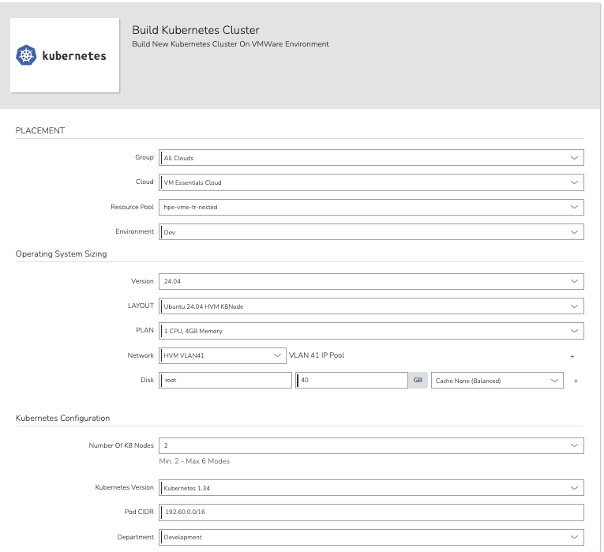
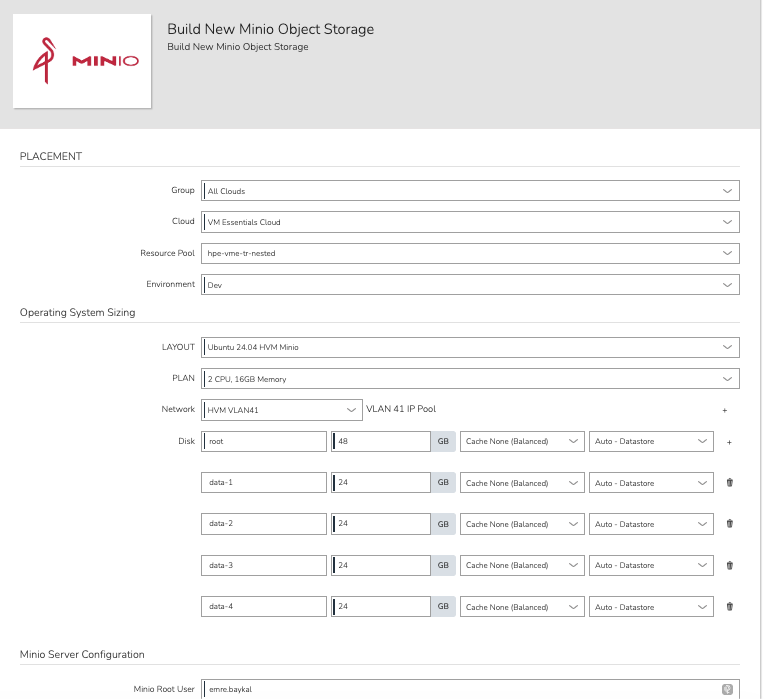
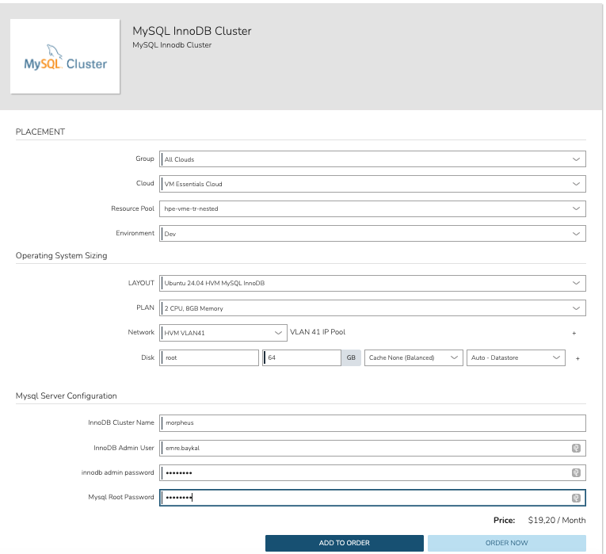
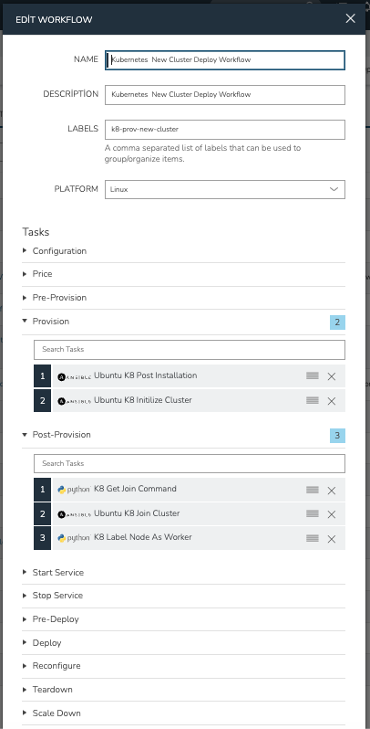
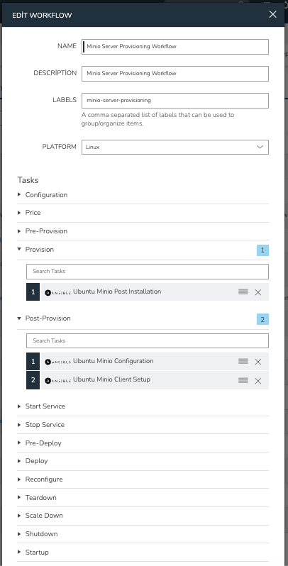
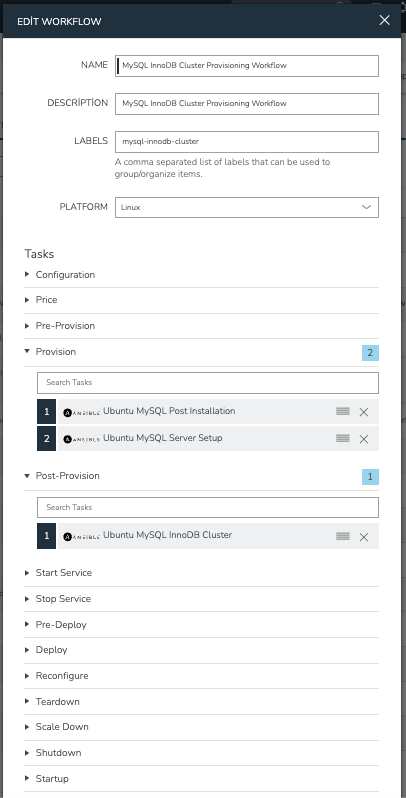
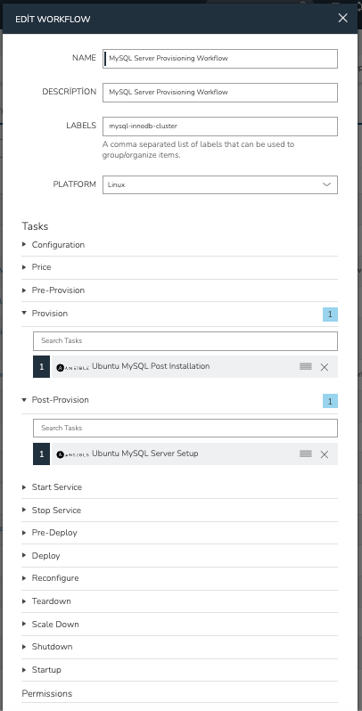

# morpheus-ansible

This repository provides an Ansible automation framework designed to deliver self-service infrastructure provisioning through **Morpheus Enterprise**. End-users initiate deployments via Morpheus Catalog Items, providing configuration inputs that are automatically injected as variables into Ansible playbooks and executed through predefined Morpheus Workflows — enabling fully automated, repeatable infrastructure delivery on Ubuntu servers without manual intervention.

The framework is built on the **Ansible role** pattern: each top-level playbook acts as an entry point that orchestrates a sequence of focused, reusable roles. This separation of concerns ensures that individual components can be developed, tested, and maintained independently while being composed into complete provisioning pipelines.

The following enterprise infrastructure stacks are supported:

- **Kubernetes** — Production-ready cluster with CNI networking, load balancing, and persistent storage
- **MySQL InnoDB Cluster** — High-availability relational database cluster
- **MinIO** — S3-compatible distributed object storage

---

## Table of Contents

- [Architecture](#architecture)
- [Technology Stack](#technology-stack)
- [Prerequisites](#prerequisites)
- [Repository Structure](#repository-structure)
- [Playbooks Overview](#playbooks-overview)
- [Morpheus Integration Parameters](#morpheus-integration-parameters)
- [Role Reference](#role-reference)
- [Python Helper Scripts](#python-helper-scripts)
- [Usage Examples](#usage-examples)
- [Security Features](#security-features)
- [License](#license)

---

## Architecture

```
╔══════════════════════════════════════════════════════════════════════╗
║                    Morpheus Enterprise Platform                      ║
║          Self-Service Catalog  ·  Workflows  ·  CMDB  ·  RBAC       ║
╚══════════════════════╤═══════════════════════════════════════════════╝
                       │
         End-user inputs injected as Ansible extra vars
                       │
          ┌────────────┼────────────┐
          │            │            │
          ▼            ▼            ▼
╔═════════════════╗ ╔══════════════════╗ ╔══════════════════╗
║   Kubernetes    ║ ║  MySQL InnoDB    ║ ║  MinIO Object    ║
║    Cluster      ║ ║    Cluster       ║ ║    Storage       ║
║                 ║ ║                  ║ ║                  ║
║ ┌─────────────┐ ║ ║ ┌──────────────┐ ║ ║ ┌──────────────┐ ║
║ │Control Plane│ ║ ║ │ Primary Node │ ║ ║ │  MinIO Node  │ ║
║ │  (kubeadm)  │ ║ ║ │(cluster init)│ ║ ║ │ (XFS disks)  │ ║
║ └─────────────┘ ║ ║ └──────────────┘ ║ ║ └──────────────┘ ║
║ ┌─────────────┐ ║ ║ ┌──────────────┐ ║ ║ ┌──────────────┐ ║
║ │ Flannel CNI │ ║ ║ │  Secondary   │ ║ ║ │  MinIO Node  │ ║
║ │  MetalLB LB │ ║ ║ │  (auto-join) │ ║ ║ │  (XFS disks) │ ║
║ │ NFS/S3 CSI  │ ║ ║ └──────────────┘ ║ ║ └──────────────┘ ║
║ └─────────────┘ ║ ║ ┌──────────────┐ ║ ║ ┌──────────────┐ ║
║ ┌─────────────┐ ║ ║ │  MySQL Shell │ ║ ║ │  mcli client │ ║
║ │  Worker ×N  │ ║ ║ │  (mysqlsh)   │ ║ ║ │ (alias conf) │ ║
║ └─────────────┘ ║ ║ └──────────────┘ ║ ║ └──────────────┘ ║
╚════════╤════════╝ ╚══════════════════╝ ╚══════════════════╝
         │
╔════════▼════════╗
║  Storage Layer  ║
║ NFS StorageClass║
║ S3  StorageClass║
╚═════════════════╝
```

---

## Technology Stack

| Component          | Technology                      | Version              |
|--------------------|---------------------------------|----------------------|
| Platform           | Morpheus Enterprise             | Latest               |
| Automation         | Ansible                         | Latest               |
| OS                 | Ubuntu Server                   | 24.04 LTS            |
| Container Runtime  | containerd                      | Latest               |
| Kubernetes         | kubeadm / kubelet / kubectl     | Configurable (1.3x)  |
| CNI Plugin         | Flannel                         | Latest               |
| Load Balancer      | MetalLB                         | v0.14.9              |
| NFS CSI Driver     | csi-driver-nfs                  | v4.9.0               |
| Package Manager    | Helm                            | Latest               |
| Database           | MySQL                           | 8.0                  |
| Cluster Mode       | MySQL InnoDB Cluster            | 8.0                  |
| DB Shell           | MySQL Shell (mysqlsh)           | 8.0                  |
| Object Storage     | MinIO                           | Latest DEB           |
| MinIO Client       | mcli                            | Latest DEB           |
| Filesystem         | XFS                             | —                    |

---

## Prerequisites

### System Requirements

| Resource | Kubernetes Nodes | MySQL Nodes  | MinIO Nodes                   |
|----------|-----------------|--------------|-------------------------------|
| OS       | Ubuntu 24.04    | Ubuntu 24.04 | Ubuntu 24.04                  |
| CPU      | 2+ cores        | 2+ cores     | 2+ cores                      |
| RAM      | 4+ GB           | 8+ GB        | 16+ GB                        |
| Disk     | 40+ GB root     | 64+ GB root  | 48+ GB root + multiple data disks |
| Network  | Static IP       | Static IP    | Static IP                     |

### Software Requirements

- Morpheus Enterprise (for workflow orchestration and variable injection)
- Ansible installed on the Morpheus worker/runner node
- Python 3 with `pip` (installed on target hosts during execution)
- SSH key-based access from Morpheus runner to all target hosts

### Network Requirements

- All nodes must be reachable over SSH (port 22) from the Ansible runner
- Nodes within each cluster must reach each other on required ports:
  - Kubernetes: 6443 (API), 2379-2380 (etcd), 10250-10259 (kubelet/scheduler/controller)
  - MySQL: 3306 (SQL), 33060 (mysqlsh), 33061 (group replication)
  - MinIO: 9000 (S3 API), 9001 (console)
- Internet access or a local mirror for APT packages
- NFS server accessible from Kubernetes nodes (for NFS StorageClass)
- MetalLB IP range must be free and routable on the local network

---

## Repository Structure

```
morpheus-ansible/
├── README.md                                    # This file
├── test.yml                                     # Test playbook (fact gathering)
│
├── ubuntu-k8-post-provision.yml                 # K8s: OS prep + packages (roles 01–06)
├── ubuntu-k8-initilize-cluster.yml              # K8s: Control plane init (role 07)
├── ubuntu-k8-join-node.yml                      # K8s: Worker node join (role 08)
├── ubuntu-k8-drain-node.yml                     # K8s: Node decommission (role 09)
├── ubuntu-k8-metalb-conf.yml                    # K8s: MetalLB load balancer (role 10)
├── ubuntu-k8-kubernetes-storage-class.yml       # K8s: NFS + S3 StorageClasses (roles 11, 18)
│
├── ubuntu-mysql-innodb.yml                      # MySQL: Full InnoDB Cluster deploy (roles 01, 12–14)
├── ubuntu-minio-object-storage.yml              # MinIO: Full object storage deploy (roles 01, 15–17)
│
├── group_vars/                                  # Group-level Ansible variable files
├── host_vars/                                   # Host-level Ansible variable files
├── images/                                      # Morpheus workflow & catalog screenshots
│
├── scripts/                                     # Python helper scripts (Morpheus tasks)
│   ├── get-join-command.py                      # Retrieve kubeadm join command → Morpheus result
│   ├── innodb_cluster_setup.py                  # InnoDB cluster creation utility
│   ├── drain-k8-command.py                      # kubectl drain via Kubernetes API
│   ├── label-k8-command.py                      # Apply labels to Kubernetes nodes
│   └── minio-bucket-create.py                   # Create MinIO buckets post-deployment
│
└── roles/
    ├── 01-ubuntu-config-issue/                  # SSH legal warning banner
    ├── 02-ubuntu-swap-file/                     # Disable swap
    ├── 03-ubuntu-ipv4-config/                   # Kernel network stack configuration
    ├── 04-ubuntu-os-update/                     # OS patching and reboot management
    ├── 05-ubuntu-containerd-conf/               # containerd container runtime
    ├── 06-ubuntu-kubernetes-conf/               # Kubernetes packages (kubelet/kubeadm/kubectl)
    ├── 07-ubuntu-kubernetes-initilize-cluster/  # Cluster initialization (control plane)
    ├── 08-ubuntu-kubernetes-join-node/          # Worker node join
    ├── 09-ubuntu-kubernetes-drain-node/         # Node decommissioning and cleanup
    ├── 10-ubuntu-kubernetes-metalb-conf/        # MetalLB load balancer deployment
    ├── 11-ubuntu-kubernetes-nfs-storage-class/  # NFS CSI driver and StorageClass
    ├── 12-ubuntu-mysql-install/                 # MySQL 8.0 installation
    ├── 13-ubuntu-mysql-innodb-cluster/          # InnoDB pre-configuration
    ├── 14-ubuntu-mysql-create-innodb-cluster/   # InnoDB cluster creation via MySQL Shell
    ├── 15-ubuntu-minio-post-provision/          # MinIO disk preparation (XFS format/mount)
    ├── 16-ubuntu-minio-conf/                    # MinIO server installation and configuration
    ├── 17-ubuntu-minio-clinet-conf/             # MinIO client (mcli) setup and alias
    └── 18-ubuntu-kubernetes-s3-storage-class/   # S3/MinIO StorageClass via Helm
```

---

## Playbooks Overview

Each top-level playbook is an entry point that delegates execution to one or more Ansible roles. Morpheus invokes these playbooks as part of a Workflow — there is no manual `ansible-playbook` execution.

> **Role execution control**: Playbooks use `when: ansible_facts['hostname'] == morpheus['instance']['name']` to restrict certain roles (control plane init, MetalLB, StorageClass, InnoDB cluster creation) to the primary node only, while base configuration roles run across all instances in the group.

### Kubernetes Stack

| Playbook | Roles Invoked | Execution Scope |
|---|---|---|
| `ubuntu-k8-post-provision.yml` | 01 → 02 → 03 → 04 → 05 → 06 | All nodes |
| `ubuntu-k8-initilize-cluster.yml` | 07 | Control plane only |
| `ubuntu-k8-join-node.yml` | 08 | Worker nodes only |
| `ubuntu-k8-drain-node.yml` | 09 | Target decommission node |
| `ubuntu-k8-metalb-conf.yml` | 10 | Control plane only |
| `ubuntu-k8-kubernetes-storage-class.yml` | 11 → 18 | Control plane only |

**Full Kubernetes cluster deployment sequence:**

```
Provision Workflow:
  └─ ubuntu-k8-post-provision.yml       [all nodes]      → roles 01, 02, 03, 04, 05, 06

Post-Provision Workflow:
  ├─ get-join-command.py                [control plane]  → retrieves kubeadm join token
  ├─ ubuntu-k8-initilize-cluster.yml   [control plane]  → role 07
  ├─ ubuntu-k8-join-node.yml           [worker nodes]   → role 08
  ├─ ubuntu-k8-metalb-conf.yml         [control plane]  → role 10
  └─ ubuntu-k8-kubernetes-storage-class.yml [control plane] → roles 11, 18
```

### MySQL InnoDB Cluster Stack

| Playbook | Roles Invoked | Execution Scope |
|---|---|---|
| `ubuntu-mysql-innodb.yml` | 01 → 12 → 13 → 14 | All MySQL nodes; role 14 on primary only |

**Full MySQL InnoDB Cluster deployment sequence:**

```
Provision Workflow:
  └─ ubuntu-mysql-innodb.yml (roles 01, 12, 13)    [all nodes]     → install + pre-configure

Post-Provision Workflow:
  └─ ubuntu-mysql-innodb.yml (role 14)             [primary only]  → InnoDB cluster creation
```

### MinIO Object Storage Stack

| Playbook | Roles Invoked | Execution Scope |
|---|---|---|
| `ubuntu-minio-object-storage.yml` | 01 → 15 → 16 → 17 | All MinIO nodes |

**Full MinIO deployment sequence:**

```
Provision Workflow:
  └─ ubuntu-minio-object-storage.yml   [all nodes]   → roles 01, 15, 16, 17
```

---

## Morpheus Integration Parameters

All parameters are injected by Morpheus Enterprise into Ansible playbooks as extra variables at runtime. These are configured through Morpheus Catalog Item custom option forms — end users fill in the values, which are then passed automatically into the workflow execution.

| Morpheus Variable | Used In Role(s) | Example Value | Description |
|---|---|---|---|
| `morpheus['customOptions']['kubernetes_vers']` | 06 | `1.34` | Kubernetes package version |
| `morpheus['customOptions']['pod_cidr']` | 07 | `192.60.0.0/16` | Pod network CIDR for Flannel |
| `morpheus['customOptions']['k8_master_ip']` | 07, 08 | `192.168.1.10` | Control plane IP address |
| `morpheus['customOptions']['metalb_ip_range']` | 10 | `192.168.1.240-192.168.1.250` | MetalLB IP address pool |
| `morpheus['customOptions']['nfs_server_ip']` | 11, 18 | `192.168.1.20` | NFS server IP address |
| `morpheus['customOptions']['nfs_share_path']` | 11, 18 | `/mnt/nfs/k8s` | NFS export path |
| `morpheus['customOptions']['mysql_root_password']` | 12, 13, 14 | `SecurePass123!` | MySQL root account password |
| `morpheus['customOptions']['innodb_admin_user']` | 13, 14 | `clusteradmin` | InnoDB cluster administrator username |
| `morpheus['customOptions']['innodb_admin_password']` | 13, 14 | `ClusterPass123!` | InnoDB cluster administrator password |
| `morpheus['customOptions']['innodb_cls_name']` | 14 | `prodCluster` | InnoDB cluster name |
| `morpheus['customOptions']['minio_root_user']` | 16, 17 | `minioadmin` | MinIO root user |
| `morpheus['customOptions']['minio_root_password']` | 16, 17 | `MinioPass123!` | MinIO root password |
| `morpheus['customOptions']['minio_s3_api_port']` | 16 | `9000` | MinIO S3 API port |
| `morpheus['customOptions']['minio_console_port']` | 16 | `9001` | MinIO web console port |
| `morpheus['results']['k8getjoin']` | 08 | *(generated)* | kubeadm join command output from `get-join-command.py` |
| `morpheus['instance']['name']` | 07, 10, 11, 14, 18 | `k8s-master-01` | Instance hostname — used to identify the primary node |
| `morpheus['instance']['configGroup']` | 14 | `mysql-cluster` | Config group listing all cluster member hostnames |

---

## Role Reference

| # | Role Directory | Purpose | README |
|---|---|---|---|
| 01 | `roles/01-ubuntu-config-issue/` | SSH legal warning banner | [README](roles/01-ubuntu-config-issue/README.md) |
| 02 | `roles/02-ubuntu-swap-file/` | Disable swap (Kubernetes requirement) | [README](roles/02-ubuntu-swap-file/README.md) |
| 03 | `roles/03-ubuntu-ipv4-config/` | Kernel network stack for Kubernetes | [README](roles/03-ubuntu-ipv4-config/README.md) |
| 04 | `roles/04-ubuntu-os-update/` | System updates and reboot management | [README](roles/04-ubuntu-os-update/README.md) |
| 05 | `roles/05-ubuntu-containerd-conf/` | containerd container runtime | [README](roles/05-ubuntu-containerd-conf/README.md) |
| 06 | `roles/06-ubuntu-kubernetes-conf/` | Kubernetes packages (kubelet/kubeadm/kubectl) | [README](roles/06-ubuntu-kubernetes-conf/README.md) |
| 07 | `roles/07-ubuntu-kubernetes-initilize-cluster/` | Kubernetes control plane initialization | [README](roles/07-ubuntu-kubernetes-initilize-cluster/README.md) |
| 08 | `roles/08-ubuntu-kubernetes-join-node/` | Worker node cluster join | [README](roles/08-ubuntu-kubernetes-join-node/README.md) |
| 09 | `roles/09-ubuntu-kubernetes-drain-node/` | Node decommissioning and cleanup | [README](roles/09-ubuntu-kubernetes-drain-node/README.md) |
| 10 | `roles/10-ubuntu-kubernetes-metalb-conf/` | MetalLB load balancer deployment | [README](roles/10-ubuntu-kubernetes-metalb-conf/README.md) |
| 11 | `roles/11-ubuntu-kubernetes-nfs-storage-class/` | NFS CSI driver and StorageClass | [README](roles/11-ubuntu-kubernetes-nfs-storage-class/README.md) |
| 12 | `roles/12-ubuntu-mysql-install/` | MySQL 8.0 installation | [README](roles/12-ubuntu-mysql-install/README.md) |
| 13 | `roles/13-ubuntu-mysql-innodb-cluster/` | MySQL InnoDB Cluster pre-configuration | [README](roles/13-ubuntu-mysql-innodb-cluster/README.md) |
| 14 | `roles/14-ubuntu-mysql-create-innodb-cluster/` | InnoDB Cluster creation via MySQL Shell | [README](roles/14-ubuntu-mysql-create-innodb-cluster/README.md) |
| 15 | `roles/15-ubuntu-minio-post-provision/` | MinIO disk preparation (XFS format/mount) | [README](roles/15-ubuntu-minio-post-provision/README.md) |
| 16 | `roles/16-ubuntu-minio-conf/` | MinIO server installation and configuration | [README](roles/16-ubuntu-minio-conf/README.md) |
| 17 | `roles/17-ubuntu-minio-clinet-conf/` | MinIO client (mcli) setup | [README](roles/17-ubuntu-minio-clinet-conf/README.md) |
| 18 | `roles/18-ubuntu-kubernetes-s3-storage-class/` | S3/MinIO StorageClass via Helm | [README](roles/18-ubuntu-kubernetes-s3-storage-class/README.md) |

---

## Python Helper Scripts

Located in the `scripts/` directory. These are registered as Morpheus Tasks and executed as part of Workflows between Ansible playbook steps.

| Script | Purpose |
|---|---|
| `get-join-command.py` | SSH to the Kubernetes control plane, retrieve the `kubeadm join` command, and return it to Morpheus as a result variable (`k8getjoin`). Retries for up to 3 minutes. |
| `innodb_cluster_setup.py` | Standalone utility for MySQL InnoDB Cluster creation. Can be run independently for troubleshooting or re-initialization. |
| `drain-k8-command.py` | Issues `kubectl drain` for a target node via the Kubernetes API. Used prior to node decommissioning. |
| `label-k8-command.py` | Applies labels to Kubernetes nodes via the API. Used for workload scheduling and node identification. |
| `minio-bucket-create.py` | Creates MinIO buckets using the MinIO Python SDK or mcli. Used for post-deployment bucket provisioning. |

---

## Usage Examples

All infrastructure deployments are initiated through **Morpheus Enterprise** — there is no manual Ansible execution. End users select a Catalog Item, fill in the required configuration parameters, and submit the order. Morpheus then executes the associated Workflow, which runs the Ansible playbooks in sequence against the provisioned instances.

### Morpheus Catalog Items

Catalog Items provide end-users with a self-service interface to configure and order infrastructure. Input values are validated and passed directly into Ansible as extra variables.

#### Build Kubernetes Cluster



#### Build New MinIO Object Storage



#### MySQL InnoDB Cluster



---

### Morpheus Automation Workflows

Workflows define the ordered sequence of Tasks (Ansible playbooks and Python scripts) that execute against provisioned instances. Morpheus distinguishes between **Provision** workflows (run during initial VM creation) and **Post-Provision / Day 2** workflows (run after provisioning completes).

#### Kubernetes New Cluster Deploy Workflow



| Phase | Tasks |
|---|---|
| Provision | Ubuntu K8 Post Installation |
| Post-Provision | K8 Get Join Command → Ubuntu K8 Initialize Cluster → Ubuntu K8 Join Cluster → K8 Label Node As Worker |

#### MinIO Server Provisioning Workflow



| Phase | Tasks |
|---|---|
| Provision | Ubuntu MinIO Post Installation |
| Post-Provision | Ubuntu MinIO Configuration → Ubuntu MinIO Client Setup |

#### MySQL InnoDB Cluster Provisioning Workflow



| Phase | Tasks |
|---|---|
| Provision | Ubuntu MySQL Post Installation → Ubuntu MySQL Server Setup |
| Post-Provision | Ubuntu MySQL InnoDB Cluster |

#### MySQL Server Provisioning Workflow



| Phase | Tasks |
|---|---|
| Provision | Ubuntu MySQL Post Installation |
| Post-Provision | Ubuntu MySQL Server Setup |

---

## Security Features

- **SSH Legal Banner**: Role 01 deploys a legal warning message to `/etc/issue.net` and configures `sshd` to display it on every connection, satisfying compliance requirements for unauthorized access warnings.
- **AppArmor Management**: Role 12 disables AppArmor before MySQL installation to prevent profile conflicts, then relies on MySQL's own access controls.
- **Credential Injection via Morpheus**: All passwords and secrets are passed as Morpheus custom options at runtime. No credentials are stored in plaintext within the repository.
- **MySQL Root Password**: Set programmatically during installation using a native password configuration file, which is removed immediately after use.
- **Blank User Removal**: Role 13 explicitly removes anonymous MySQL users created by the default installation.
- **Test Database Removal**: Role 13 drops the default `test` database shipped with MySQL.
- **MinIO System User**: Role 16 creates a dedicated `minio` system user with no login shell to run the MinIO service under least privilege.
- **Kubernetes RBAC**: kubeadm initializes the cluster with RBAC enabled by default.

---

## License

MIT License

Copyright (c) 2025

Permission is hereby granted, free of charge, to any person obtaining a copy of this software and associated documentation files (the "Software"), to deal in the Software without restriction, including without limitation the rights to use, copy, modify, merge, publish, distribute, sublicense, and/or sell copies of the Software, and to permit persons to whom the Software is furnished to do so, subject to the following conditions:

The above copyright notice and this permission notice shall be included in all copies or substantial portions of the Software.

THE SOFTWARE IS PROVIDED "AS IS", WITHOUT WARRANTY OF ANY KIND, EXPRESS OR IMPLIED, INCLUDING BUT NOT LIMITED TO THE WARRANTIES OF MERCHANTABILITY, FITNESS FOR A PARTICULAR PURPOSE AND NONINFRINGEMENT. IN NO EVENT SHALL THE AUTHORS OR COPYRIGHT HOLDERS BE LIABLE FOR ANY CLAIM, DAMAGES OR OTHER LIABILITY, WHETHER IN AN ACTION OF CONTRACT, TORT OR OTHERWISE, ARISING FROM, OUT OF OR IN CONNECTION WITH THE SOFTWARE OR THE USE OR OTHER DEALINGS IN THE SOFTWARE.
